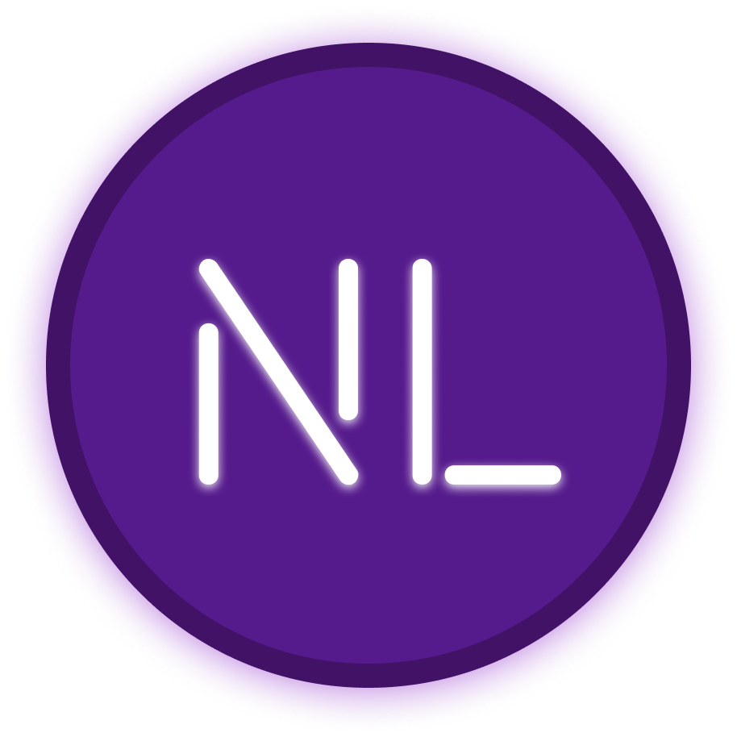

<h1 align="center">NeoLang - new generation language</h1>
<p align="center"></p>
<div align="center">


</div>
<p align="center">Neolang is an interpreted programming language created by Filler. This programming language is designed for the purpose of creating simple scripts. This programming language is similar in syntax to Python, C++ and JavaScript.</p>
*An example of a simple code in Elang that outputs Hello, world!*

```shell
print("Hello, world!")
```

*An example of code that asks the user for their name and displays it*
```shell
var name = ("What's u name?")
print(name)
```
